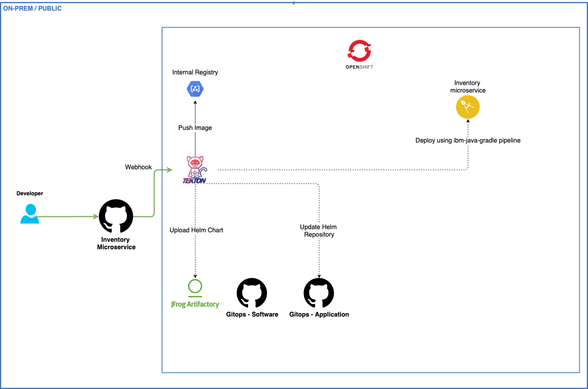
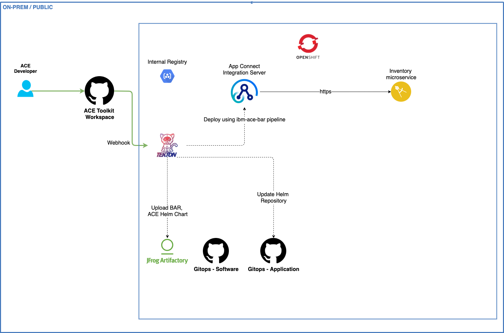

# Build and deploy an App Connect REST API workflow

<!--- cSpell:ignore CICD cntk pipelinerun subflow mgmt -->

Learning tasks for developers to understand the IBM middleware integration use cases on Red Hat OpenShift.

## Self-paced agenda to build and deploy an App Connect REST API workflow

This activity provides a working example of a Tekton based CICD pipeline to build and deploy an App Connect application invoking the REST API of the [Inventory Management Service](https://github.com/ibm-garage-cloud/inventory-management-svc-solution).
The Pipeline and Task resources available in the [Cloud Native Toolkit](https://cloudnativetoolkit.dev/) can be used as a starting point to build BAR files for other ACE workflows.

The activity consists of the following tasks:

  1. [Prerequisites](#prerequisites)
  2. [Deploy the Inventory Management Service](#deploy-the-backend-inventory-management-service)
  3. [Configure the App Connect workflow with the Inventory REST API URL](#configure-the-app-connect-workflow)
  4. [Execute the the App Connect pipeline to build and deploy the configured workflow](#execute-the-app-connect-pipeline)

### Prerequisites

| Task                             | Instructions                             |
| ---------------------------------| -----------------------------------------|
| Active OpenShift 4.x Cluster     |                                          |
| Set up accounts and tools        | [Instructions](../../../overview/prerequisites.md) |
| Install the Cloud Native Toolkit | [Install the Cloud Native Toolkit](../../../setup/setup-options.md) |
| Install IBM Cloud Pak for Integration | [Install Cloud Pak for Integration v2020.4](https://www.ibm.com/docs/en/cloud-paks/cp-integration/2020.4?topic=installing) |

### Deploy the backend Inventory Management Service

The image below depicts the Tekton pipeline executed.



1. Open a terminal and log into your OpenShift cluster.  For IBM Cloud, navigate to your cluster in the *IBM Cloud console*, click on the **Access** tab, and follow the
  instructions to log in to the cluster from the command line.
2. Create a development namespace.

    ```shell
    oc sync ${DEV_NAMESPACE} --dev
    ```

3. Open the Developer Dashboard

    ```shell
    oc dashboard
    ```

4. From the Developer Dashboard, click on **Starter Kits** tab.  Click on the **Inventory Service** tile to create your app github repository from the template repository selected. You can also click on the **Git Icon** to browse the source template repository and click on the **Template** to create the template.
5. Complete the [GitHub create repository from template](https://help.github.com/en/github/creating-cloning-and-archiving-repositories/creating-a-repository-from-a-template) process.

    **Owner**: Select a validate GitHub organization that you are authorized to create repositories within or the one you were given for the shared cluster (See warning above)

    **Repository name**: Enter a valid name for you repo, GitHub will help with showing a green tick if it is valid (See warning above)

    **Description**: Describe your app

    Press **Create repository from template** and the new repository will be created in your selected organization.

6. With the browser open to the newly created repository, click on **Clone or download** and copy the clone *SSH link*, and use the `git clone` command to clone it to your developer desktop machine.

    ```shell
    git clone git@github.com:{gitid}/inventory-management-svc-solution.git
    ```

7. Change into the cloned directory.

    ```shell
    cd inventory-management-svc-solution
    ```

8. Set a base path for the REST API for the Inventory Management Service.

    === "OpenShift 4.0 - 4.5"
        1. Edit **src/main/resources/application.yml** and update the *server* section to include the `/api` base path to *server.servlet.context-path*.

            ```shell
            server:
            port: ${PORT:9080}
            servlet:
                context-path: "/api"
            ```

        2. Edit the file **chart/base/values.yaml** and set the *route.path* from `/` to `/api`.

            ```shell
            route:
            enabled: false
            rewriteTarget: "/"
            path: "/api"
            ```

    === "OpenShift 4.6+"
        1. Edit the file **chart/base/values.yaml** and set the *route.path* from `/` to `/api`.

            ```shell
            route:
            enabled: false
            rewriteTarget: "/"
            path: "/api"
            ```

9. Set the namespace context.

    ```shell
    oc project {DEV_NAMESPACE}
    ```

10. Register the App in a DevOps Pipeline

    ```shell
        oc pipeline
    ```

11. Select the **Tekton** pipeline type.
12. The first time a pipeline is registered in the namespace, the CLI will ask for your username and **Personal Access Token** for the Git repository.  The credentials will be stored in a secret named `git-credentials`. It will use the current branch.

    **Username**: Enter your GitHub user id

    **Personal Access Token**: Paste your GitHub personal access token

13. When registering a `Tekton` pipeline, you will also be prompted to select which pipeline you want to use for your application. Select `ibm-java-gradle`.

14. Select `Y`/`n` to enable the pipeline to scan the image for vulnerabilities.
15. Provide `/api/health` as the health endpoint.  This is needed by the pipeline when running the **health** Task.
16. After the pipeline has been created, the command will set up a webhook from the Git host to the pipeline event listener.

    !!!Note
        If the webhook registration step fails it is likely because the Git credentials are incorrect or do not have enough permission in the repository.

    The pipeline will be registered in your development cluster and a pipelinerun will be started.
17. View your application pipeline.

    ```shell
    oc console
    ```

18. From menu on the left switch to the **Developer** mode and select the *dev* project that was used for the application pipeline registration.
19. In the left menu, select *Pipelines* and click on the link to the `inventory-management-svc-solution-xxxxxx` PipelineRun (PLR).
20. Validate the REST API of the Inventory Management service is working correctly in the terminal.

    ```shell
    curl https://$(oc get route inventory-management-svc-solution -o jsonpath='{ .spec.host }')/api/stock-items
    ```

    The response should be similar to the following output.

    ```text
    [{"name":"Item 1","id":"1","stock":100,"price":10.5,"manufacturer":"Sony"},{"name":"Item 2","id":"2","stock":150,"price":100.0,"manufacturer":"Insignia"},{"name":"Item 3","id":"3","stock":10,"price":1000.0,"manufacturer":"Panasonic"},{"name":"Item 4","id":"4","stock":9,"price":990.0,"manufacturer":"JVC"}]
    ```

Here is a view of a completed and successful pipelinerun.


### Configure the App Connect workflow

1. Download and install the [ACE Toolkit](https://www.ibm.com/support/knowledgecenter/SSTTDS_11.0.0/com.ibm.etools.mft.doc/get-started-handson.html) and follow steps 1 and 2.
2. Fork the [inventory-mgmt-ace-solution](https://github.com/ibm-garage-cloud/inventory-mgmt-ace-solution) repository.  The new repository will be created in your selected organization.
3. With the browser open to the newly created repository, click on **Clone or download** and copy the clone *SSH link*, and use the `git clone` command to clone it to your developer desktop machine.
  
    ```shell
    git clone git@github.com:{gitid}/inventory-mgmt-ace-solution.git
    ```

4. Change into the cloned directory

    ```shell
    cd inventory-mgmt-ace-solution/workspace/InventoryManagementSvc
    ```

5. Obtain the URL of the Inventory Management SVC route.

    ```shell script
    echo $(oc get route inventory-management-svc-solution -o jsonpath='{ .spec.host }')
    ```

6. Search and replace the placeholder `INVENTORY_MANAGEMENT_SVC_BASE_URL` with the Route URL in the *listStockItemsUsingGET.subflow* and *ace-inventory-management-svc.json* files.
7. Commit and push the changes into your forked repository.

### Execute the App Connect pipeline

The image below depicts the Tekton pipeline executed.



1. Create a Secret containing the IBM Entitled Registry credentials to pull the ACE image for the CI process in the pipeline.

    ```shell
    oc create secret generic ibm-entitled-registry --type="kubernetes.io/basic-auth" --from-literal=username=cp --from-literal=password=<IBM Entitlement Key>
    ```

2. Register the App in a DevOps Pipeline

    ```shell
        oc pipeline
    ```

3. Select the `Tekton` pipeline type.  You should not be prompted for Git credentials as a Secret already exists with your username and token.
4. When registering a `Tekton` pipeline, you will also be prompted to select which pipeline you want to use for your application. Select `ibm-ace-bar`.
5. Select `Y`/`n` to enable the pipeline to scan the image for vulnerabilities.
6. Provide `/api/stock-items` as the health endpoint.  This is needed by the pipeline when running the **health** Task.
7. After the pipeline has been created, the command will set up a webhook from the Git host to the pipeline event listener

    !!!Note
        If the webhook registration step fails it is likely because the Git credentials are incorrect or do not have enough permission in the repository.

    The pipeline will be registered in your development cluster.
8. View your application pipeline

    ```shell
    oc console
    ```

9. From menu on the left switch to the **Developer** mode and select *dev* project that was used for the application pipeline registration.
10. In the left menu, select *Pipelines* and click on the link to the `inventory-mgmt-ace-solution-xxxxxx` PipelineRun (PLR).
11. Validate the App Connect server is working correctly in the terminal.

    ```shell
    curl http://$(oc get route inventory-mgmt-ace-solution-http -o jsonpath='{ .spec.host }')/api/stock-items
    ```

    The response should be similar to the following output.

    ```text
    [{"name":"Item 1","id":"1","stock":100,"price":10.5,"manufacturer":"Sony"},{"name":"Item 2","id":"2","stock":150,"price":100.0,"manufacturer":"Insignia"},{"name":"Item 3","id":"3","stock":10,"price":1000.0,"manufacturer":"Panasonic"},{"name":"Item 4","id":"4","stock":9,"price":990.0,"manufacturer":"JVC"}]
    ```

Here is a view of a completed and successful pipelinerun.


