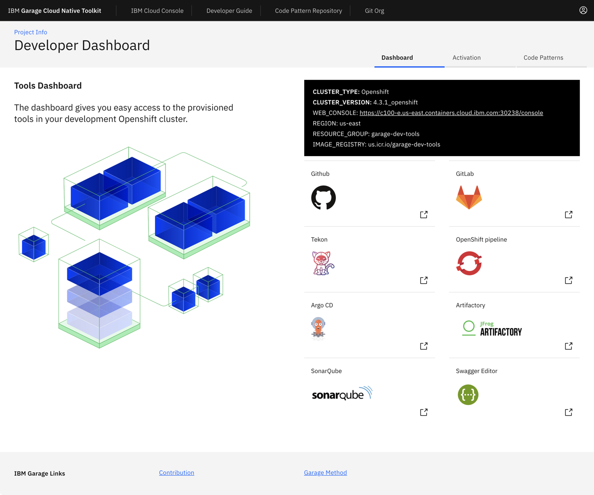
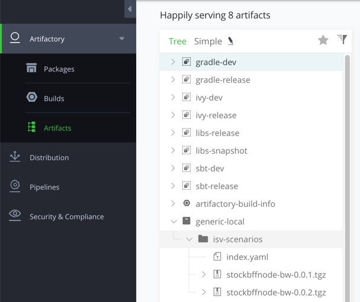
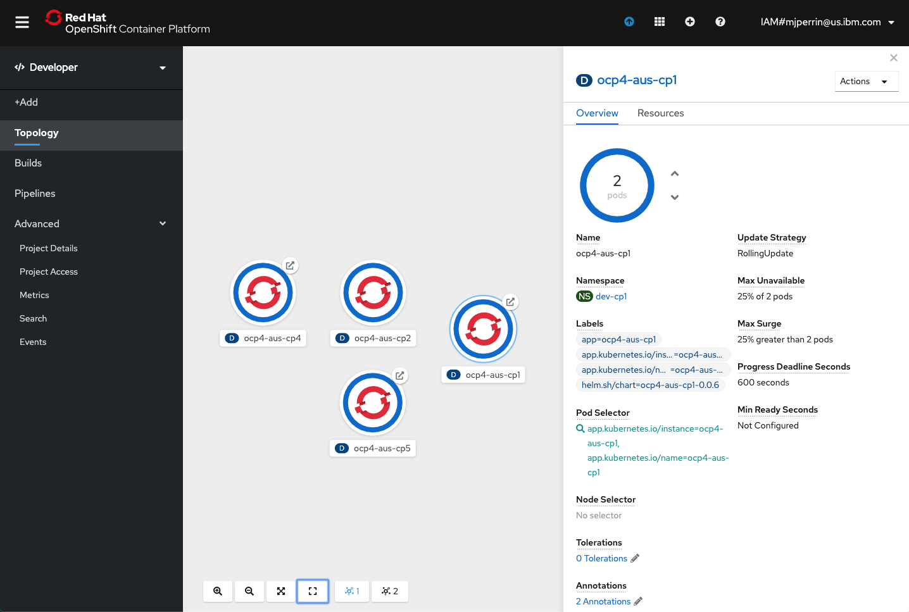
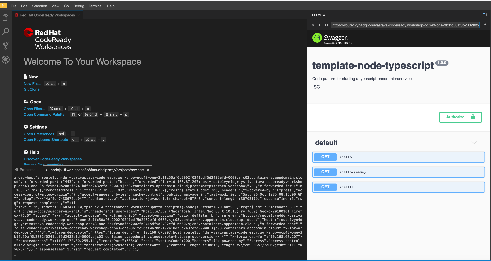

# Continuous Integration - fast start

<!--- 
    cSpell:ignore deployapp stockbffnode openshiftconsole tektonpipeline userid iccr podsiks viewapp
    cSpell:ignore crwopenlink crwopenapp yourprojectName
-->

## Overview

The environment supports end-to-end development and deployment of an application. The instructions below will show you how to do it.

<iframe width="100%" height="500" src="https://www.youtube-nocookie.com/embed/czYQfvPTa7Y" title="YouTube video player" frameborder="0" allow="accelerometer; autoplay; clipboard-write; encrypted-media; gyroscope; picture-in-picture" allowfullscreen></iframe>

You can create a new app using one of the [Starter Kits](../reference/starter-kit/starter-kit.md){: target=_blank }. These have been created to include all the key components, configuration, and frameworks to get you started on creating the code you need for your solutions. The approach for getting started is exactly the same for an environment based on **Kubernetes** or **Red Hat OpenShift**.

!!!Note
    The instructions provided below lean heavily on the use of the IGC Command Line Interface (CLI) tool, to both show how the CLI works in context and to streamline the process (the reason for creating the CLI in the first place). However, the use of the CLI is in no way required to use the Cloud-Native Toolkit. If you would prefer to work through these instructions without the use of the CLI, we have provided the equivalent manual steps for each command on the [Cloud-Native Toolkit CLI](../reference/cli.md){: target=_blank } page.

The video below (click to play the video) demonstrates how to work through the steps to create an application and use a deployment pipeline to install it into your development cluster.

[{: style="width: 80%" .center }](../videos/deployapp.m4v "Deploying an App"){: target=_blank}

## Create an application

### 1. Log into your Development Cluster from the command line

Before starting, make sure you have set up your [development tools](dev-setup.md){: target=_blank}.

=== "Cluster managed by IBM Cloud"

    Log into the cluster with `icc [cluster name|cluster nickname]`

=== "OpenShift cluster"

    Run `oc login $SERVER -u $OCP_USERNAME -p $OCP_PASSWORD`

You should now be able to access the OpenShift console:

```shell
oc console
```

!!!Note
    If your workshop is on Code Ready Workspaces, follow the steps in [Code Ready Workspaces Setup](../resources/ibm-cloud/crw.md) before logging in to the cluster. The remaining steps assume this step has already been performed. If you stop and then come back later it is a good idea to re-run this step again before proceeding

### 2. Create the development namespace

Before getting started, the development namespace/project needs to be created and prepared for the DevOps pipelines. This is something that would typically happen once at the beginning of a project when a development team is formed and assigned to the cluster.

This step copies the common `secrets` and `configMaps` that contain the CI/CD configuration from the `tools` namespace into the development namespace/project. This enables the pipelines to reference the values easily for your project.

```shell
oc sync -p ${DEV_NAMESPACE}
```

!!!Info
    The **-p** or **--tekton** flag adds additional privileges to the tekton pipeline service account.  The equivalent command is `oc adm policy add-scc-to-user privileged -z pipeline`.  In OpenShift 4.7, and later versions, this additional privilege is needed for the buildah task.

### 3. Open the Developer Dashboard

The [Developer Dashboard](../reference/dashboard.md) makes it easy for you to navigate to the tools, including a section that allows you to select a set of pre-configured [Starter Kits](../reference/starter-kit/starter-kit.md) that make seeding your development project very easy.

Before starting, open a browser and make sure you are logged into [Github](https://github.com). There are two options for how to access the dashboard:

=== "OpenShift console"

    Open the Application Launcher dropdown from the top-right and select **Developer Dashboard** 

    

=== "Command Line"

    ```shell
    oc dashboard
    ```

### 4. Create your app in Git

!!!Warning
    If you are developing on a shared education cluster, you need to make it easy to identify your app. Please suffix the app name with your initials `{app name}-{your initials}` (e.g. `stockbffnode-mjp`) and use the **Git Organization** for the shared environment.

!!!Warning
    Your browser needs to be logged in to your GitHub account for a template to work. If the link from the tile displays the GitHub 404 page, log in and reload the page.

1. From the Developer Dashboard, click on **Starter Kits** tab

2. Pick one of the templates that is a good architectural fit for your application and the language and framework that you prefer to work with. For your first application, select the **Typescript Microservice**. This also works well in the Cloud Shell.

    Click on a Starter Kit **Tile** to create your app github repository from the template repository selected. You can also click on the **Git Icon** to browse the source template repository and click on the **Template** to create the template.

3. Complete the [GitHub create repository from template](https://help.github.com/en/github/creating-cloning-and-archiving-repositories/creating-a-repository-from-a-template) process.

    - **Owner**: Select a valid GitHub organization that you are authorized to create repositories within or the one you were given for the shared cluster (See warning above)
    - **Repository name**: Enter a name for your repo. GitHub will help with showing a green tick if it is valid (See warning above)
    - **Description**: Describe your app

    Press **Create repository from template**

    

4. The new repository will be created in your selected organization.

## Create the DevOps pipeline

### 5. Register the application in a DevOps Pipeline

!!!Info
    We will be using the `pipeline` command of the IBM Garage Cloud cli to register the DevOps pipeline. The pipeline command gives an option for both `Jenkins` and `Tekton`. For more information about working with the different build engines, please see [Continuous Integration with Jenkins Guide](../reference/tools/jenkins.md) and [Continuous Integration with Tekton Guide](../reference/tools/tekton.md)

1. Open a browser to the Git repository created in the previous step.

2. Copy the url to the Git repository. For GitHub this is done by pressing the `Code` button and copying the url provided in the `Clone` section.

3. Start the process to create a pipeline.

    ```shell
    oc pipeline ${GIT_URL}
    ```

    For example:

    ```shell
    oc pipeline https://github.com/gct-showcase/inventory-svc
    ```

4. For the deployment of your first app with OpenShift select **Tekton** as the CI engine.

5. The first time a pipeline is registered in the namespace, the CLI will ask for a username and **Password**/**Personal Access Token** for the Git repository that will be stored in a secret named `git-credentials`.

    - **Username**: Enter your GitHub user id
    - **Personal Access Token**: Paste your GitHub personal access token

6. When registering a `Tekton` pipeline, the CLI will attempt to determine the runtime used by the repository that was provided and filter the available pipelines. If only one matches then it will be automatically selected. If it cannot find a match or there is more than one match then you will be prompted to select the pipeline.

7. When registering a `Tekton` pipeline, the CLI also reads the available parameters from the pipeline and generates prompts for input. In this case, the option of scanning the built image for vulnerabilities is the only options. The scan is performed by the Vulnerability Advisor if you are using IBM Image Registry or by [Trivy](https://github.com/aquasecurity/trivy) if another image registry is used. This scan is performed in "scan" stage of pipeline after "img-release" stage.

    ```shell
    ? scan-image: Enable the pipeline to scan the image for vulnerabilities?(Y/n)
    ```

8. To skip the scan, you have type "n" (No).Otherwise, type "y" (Yes) for performing Vulnerability Scanning on the image.

9. After the pipeline has been created,the command will set up a webhook from the Git host to the pipeline event listener.

    !!!Note
        if the webhook registration step fails, it is likely because the Git credentials are incorrect or do not have enough permission in the repository.

10. When the command is completed it will present options for next steps. You can use the Tekton cli commands to inspect the pipeline run that has been created and tail the log and/or navigate to the provided url to see the pipeline running from the OpenShift console.

### 6. View your application pipeline

The steps to view your registered pipeline will vary based on type of pipeline (`Jenkins` or `Tekton`) and container platform version.

=== "Tekton"

    === "OpenShift 4.x"

        1. Open the OpenShift Web Console

            ```shell
            oc console
            ```

            **OR**

            

        2. From menu on the left switch to the **Developer** mode

        3. Select _dev_ project that was used for the application pipeline registration

        4. In the left menu, select *Pipelines*

        You will see your application DevOps pipeline now starting to build and once completed will look like the image below.

        

    === "Kubernetes"

        1. Open the Developer Dashboard

            ```shell
            kubectl dashboard
            ```

        2. Select the `Tekton` tile to launch the Tekton UI

        3. Select your development project

=== "Jenkins"

    === "OpenShift 4.x"

        1. Open the OpenShift Web Console

            ```shell
            oc console
            ```

            **OR**

            

        2. From the left-hand menu, select `Builds` -> `Build Configs`

        3. Select your project from the drop-down menu at the top

        4. The registered pipeline should appear in the list

    === "Kubernetes"

        1. Run the command `oc dashboard` in your terminal to open your [Developer Dashboard](../reference/dashboard.md)
        2. Select the Jenkins tool to open the Jenkins dashboard
        3. Run the command `kubectl credentials` in your terminal to get the list of logins for the tools
        4. Use the Jenkins userid and password to log into the Jenkins dashboard

        Wait for the pipeline stages to start building. Once the stages have completed, you will see a view similar to the one below.

        

### 7. View your application artifacts

!!!Todo
    What happens if the cluster is not running on IBM Cloud - registry?

The pipeline built two artifacts for deploying your app:

- Container image -- The [image registry](../reference/tools/ibm-cloud-container-registry.md){: target=_blank} includes a container image with your app built in
- Helm chart -- The [artifact repository](../reference//tools/artifactory.md){: target=_blank} includes a [Helm chart repository](https://helm.sh/docs/topics/chart_repository/) that includes a Helm chart for deploying your app

Let's look at these artifacts in the Toolkit environment.

The container image is stored in the IBM Cloud Container Registry:

1. From the OpenShift console's tools menu or from the Developer Dashboard's tools page, select Image Registry.
2. In the image registry, you'll see the image the pipeline built for your app, such as `us.icr.io/isv-scenarios/stockbffnode-bw` with a different tag for each build.

    

The Helm chart is stored in Artifactory:

1. From the OpenShift console's tools menu or from the Developer Dashboard's tools page, select Artifactory.
2. In the Artifactory console, select Artifactory > Artifacts > generic-local. You'll see a `isv-scenarios` folder with a different chart for each build, such as `generic-local/isv-scenarios/stockbffnode-bw-0.0.1.tgz`.

    

### 8. Access the running app

Once the pipeline has completed successfully, the app will be deployed into the namespace used when registering the pipeline. To validate the app is running follow these steps:

!!!Note
    Be sure the namespace context is set correctly before running the following commands

1. Retrieve the app ingress endpoint using commands below in your terminal.

    ```shell
    oc endpoints
    ```

2. From the endpoints listed, select the URL for the repo that was just deployed and press **Enter** to open that URL in a web browser. Validate the application is working as expected.

### 9. Locate the app in the web console

The build pipeline is configured to build the source code from the Git repository into a container image. This image is stored in the Image Registry. After that, the image is deployed into the same namespace/project within the development cluster where the pipeline ran and validated for its health. The steps below will walk through locating the installed application within the Web Console.

=== "OpenShift 4.x"

    1. Open the **OpenShift web console**
    
        ```shell
        oc console
        ```

    2. Change to the **Developer** view
    3. Click on **Topology** menu
    4. Click on your application deployment in the topology view
    5. Click on the **Overview** tab
    6. Increase the number of running pods to 2 pods
    7. Click on the **Resources** tab to view the list of pods
    8. Click on **View Logs** link to view the logs from each pod
    9. You can see the running state of your application

    

=== "Kubernetes"

    1. Open the **Kubernetes Dashboard**

        ```shell
        kubectl console
        ```

    2. Change to the namespace from `default` to either `dev` or the namespace you used to deploy your app
    3. Click on **Deployments**
    4. You should see the deployment of your application
    5. Click on your application , and the corresponding **Replica Set**
    6. Try scaling the application, click on **Scale** in the header, change number of pods to 2 and click **OK**
    7. Click on one of the `pod` instances
    8. Click on **Logs**
    9. You can see the running state of your application
    10. Navigate around the console to understand where your deployment, service and pods are running

    

!!!Success
    You now have your application running inside your development cluster and being delivered using a Tekton based CI pipeline. This is the beginning of the developer journey with IBM Cloud.

Having reached this point, we recommend you repeat the process a few more times using different **Code Patterns** templates and explore the **Developer** view in OpenShift to get familiar with it.

## Run the application locally

### 10. Clone your code to you local machine

1. Open a browser to the Git repository created in the previous step.

2. Copy the url to the Git repository. For GitHub this is done by pressing the `Code` button and copying the url provided in the `Clone` section.

3. Clone the repository using the url from the terminal.

    ```shell
    git clone ${GIT_URL}
    ```

    For example:

   ```shell
   git clone https://github.com/gct-showcase/inventory-svc
   ```

4. You will be required to enter your **GitHub User ID** and use your **Git Hub Personal Access Token** as your password. This will complete the clone of your git repository.

5. Change into the cloned directory

    ```shell
    cd stockbffnode
    ```

### 11. Run the application locally

Most developers like to run the code natively in local development environment. To do so, follow the instructions listed in the **README.md** file to run the code locally.
You may be required to install a specific runtime like **Java**, **Node** or **Go**.

1. If you want to quickly access your git repo you can run a helper command to open the git webpage.
  
    ```shell
    oc git
    ```

2. From inside the folder where the code was cloned from GitHub, run the following command to install the Node.js dependencies.

    ```shell
    npm install
    ```

- Run the following command to start the application.

    ```shell
    npm run start
    ```

=== "Cloud Shell"

    - To view the running app click on the **Eye Icon** on the top right and select the port `3000` this will open a browser tab and display the running app on that port.

    

=== "Cloud Ready Workspaces"

    

    - Click on open link

    

    - To view this application in new tab click top right corner arrow icon

=== "Desktop/Laptop"

    - Open a browser to `http://localhost:3000/api-docs/`

- You can try out the sample API that is provided with this **Code Pattern**

- You can now add new features and function from inside the Cloud Shell and experiment with your code before you push any changes back to git.

### 12. Test the webhook

1. Go to your cloned git project and navigate to *chart/base* directory.

    ```shell
    cd stockbffnode
    cd chart/base
    ```

2. Open the file `Chart.yaml` in edit mode and change the `description` field's value from "A Helm chart for Kubernetes" to "A Helm chart for [yourprojectName]"
3. Save the edits
4. Push the changes back to your repository

    ```shell
    git add .
    git commit -m "Update application name"
    git push
    ```

5. As soon as you push your code changes successfully, the webhook will trigger a new pipeline run for your project in your namespace in OCP.
  
    !!!Note
        if the webhook registration step failed, the git push will not trigger the pipeline.
